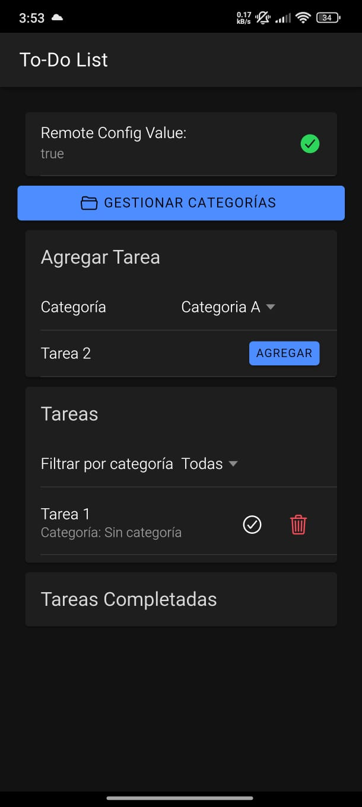
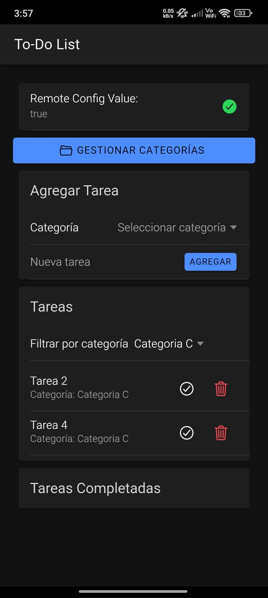
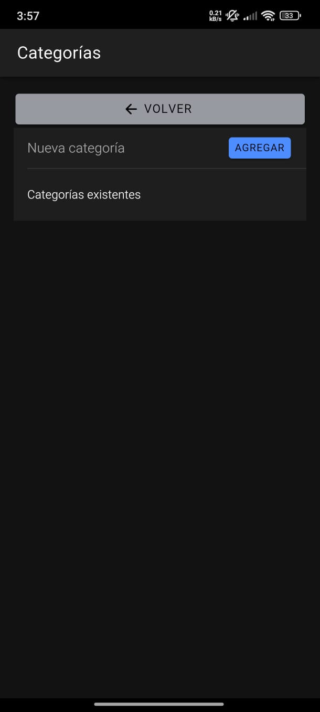

# Prueba Dev Frontend

Esta es una aplicación móvil de lista de tareas desarrollada con Ionic Framework y Angular, con soporte para exportación a Android e iOS usando Apache Cordova.

## Autor

Nombre: Alex Cudriz  
Email: alex.d.cudriz@accenture.com  
GitHub: [https://github.com/alexdavcudriz](https://github.com/alexdavcudriz)

## Características

- Crear, completar y eliminar tareas.
- Asignar categorías personalizadas a tareas.
- Filtrar tareas por categoría.
- Persistencia local (localStorage).
- Interfaz moderna con Ionic.
- Compatible con Android e iOS (usando Cordova).

## Tecnologías

- Ionic Framework
- Angular
- Apache Cordova
- HTML, SCSS, JavaScript

---

## Instalación

```bash
git clone https://github.com/alexdavcudriz/PruebaDevFrontend.git
cd PruebaDevFrontend
npm install
```

## Requisitos

- Node.js y npm
- Ionic CLI (`npm install -g @ionic/cli`)
- Cordova CLI (`npm install -g cordova`)
- Android Studio (para Android)
- Xcode (para iOS, solo en macOS)

---

## Agregar integración Cordova

```bash
ionic integrations enable cordova
```

## Agregar plataformas

```bash
ionic cordova platform add android
ionic cordova platform add ios
```

---

## Ejecutar en navegador

```bash
ionic serve
```

---

## Ejecutar en Android

### Emulador Android

```bash
ionic cordova emulate android
```

### Dispositivo físico Android

```bash
ionic cordova run android
```

---

## Construir APK Android

### Debug APK

```bash
ionic cordova build android
```

### Release APK

```bash
ionic cordova build android --release
```

---

### Ubicación del APK:


```bash
build: platforms/android/app/build/outputs/apk/debug/app-debug.apk

demo: runnables/
```

---

## Ejecutar en iOS

> ⚠️ Solo disponible en macOS con Xcode instalado.

### Abrir en Xcode

```bash
ionic cordova build ios
open platforms/ios/*.xcworkspace
```

### Ejecutar en simulador iOS

```bash
ionic cordova emulate ios
```

### Ejecutar en dispositivo iOS

Conecta tu iPhone por USB y autoriza el dispositivo desde Xcode.

---

## Capturas de Pantalla

### Lista de tareas (Home)


---

### Lista de categorias


---

### Se crean dos categorias y tres tareas




---

### Se modifica el nombre de la categoria A a C
se puede ver el cambio de los iconos cuando se selecciona editar.


---

### Se completan dos tareas
se puede ver el cambio de los iconos cuando se selecciona editar.


---

### Se regresa una tarea a pendiente


---

### Se crean dos tareas mas para probar los filtro


Filtro: Sin Categoria


Filtro: Categoria C


Filtro: Categoria B


Filtro: Todas


---

### Se eliminan las categorias




---

### Prueba remote config

La app esta leyendo el valor que se creo en este remote config:


Como vemos en la parte superior se esta mostrando el valor del config


Cambiamos el valor del config


despues de actualizar la vista se ve el nuevo valor del config


---

## Estructura del proyecto

```
src/
├── app/
│   ├── home/           # Página principal
│   ├── categories/     # Gestión de categorías
│   ├── models/         # Interfaces Task y Category
├── assets/
├── index.html
```

---

## Respuestas

#### 1. ¿Cuáles fueron los principales desafíos que enfrentaste al implementar las nuevas funcionalidades?

Uno de los desafíos más grandes fue integrar Firebase con Cordova, especialmente usando el plugin `cordova-plugin-firebasex`. Me encontré con varios errores durante la construcción del APK, como incompatibilidades de versión, errores como `cordova_not_available` al ejecutar en navegador, y métodos no soportados por el plugin como `getRemoteConfigValue` o `getBoolean`.

Otro reto importante fue configurar correctamente `google-services.json`, ya que en un punto el nombre del paquete en el archivo no coincidía con el de mi proyecto, lo cual causaba el error: *"No matching client found for package name"*.

También fue complicado trabajar con Remote Config en el navegador, ya que Cordova no está diseñado para ejecutarse en ese entorno. Eso me llevó a explorar alternativas con el SDK Web de Firebase para simular correctamente el comportamiento.

#### 2. ¿Qué técnicas de optimización de rendimiento aplicaste y por qué?

Una de las primeras optimizaciones que implementé fue configurar parámetros como `minimumFetchIntervalMillis` y `fetchTimeoutMillis` en Remote Config. Esto me permitió reducir la cantidad de llamadas a la red y acelerar el tiempo de respuesta de la aplicación.

En cuanto a la lógica de la app, optimicé el filtrado de tareas por categoría en memoria usando Angular con `*ngFor` y filtros reactivos basados en `ngModel`, lo que evitó cálculos innecesarios.

También limpié las dependencias no utilizadas del proyecto. Por ejemplo, eliminé plugins de Firebase que no estaban aportando valor o que causaban conflictos. Esto mejoró el tiempo de build y redujo el tamaño del proyecto.

Finalmente, implementé carga diferida de datos con `async/await` para asegurar que la UI no intentara mostrar datos que aún no estaban disponibles, lo cual ayudó a evitar errores y mejorar la experiencia de usuario.

#### 3. ¿Cómo aseguraste la calidad y mantenibilidad del código?

Para asegurar la calidad del código, organicé la lógica de Remote Config dentro de un servicio (`FirebaseRemoteConfigService`). Esto me permitió tener una única fuente de verdad para las configuraciones remotas y facilitó mucho su mantenimiento.

También utilicé un archivo separado llamado `firebase.config.ts` para manejar las propiedades y configuraciones de Firebase, lo cual hace más limpio el archivo principal del componente y evita la repetición de código.

Seguí buenas prácticas de Angular e Ionic, como el uso de `*ngIf`, `*ngFor`, y bindings limpios. Además, documenté todo en un README y utilicé `console.log` de manera controlada para pruebas locales y debugging.

Otra buena práctica fue probar la app en múltiples entornos: primero en navegador, luego en emulador Android, y finalmente generando el APK. Esto me ayudó a asegurarme de que el comportamiento fuera consistente.

Por último, eliminé por completo dependencias conflictivas como `cordova-plugin-firebasex` y migré a soluciones más mantenibles, lo cual simplificó mucho el entorno del proyecto.
